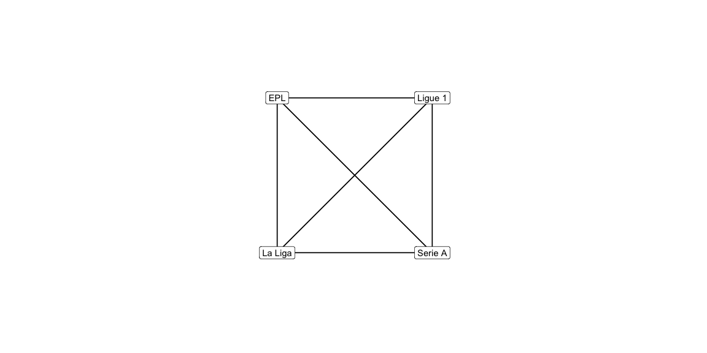
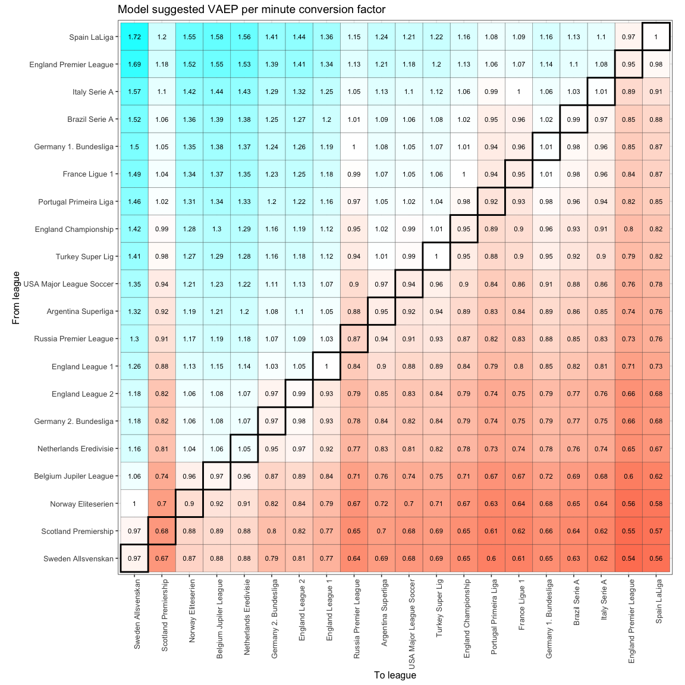
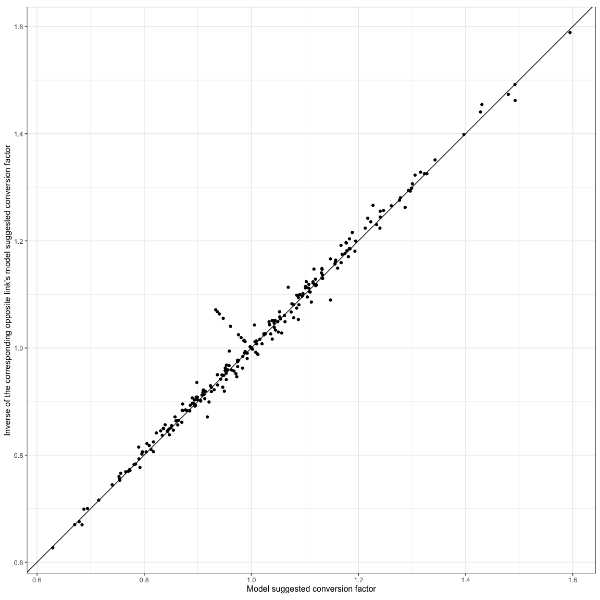
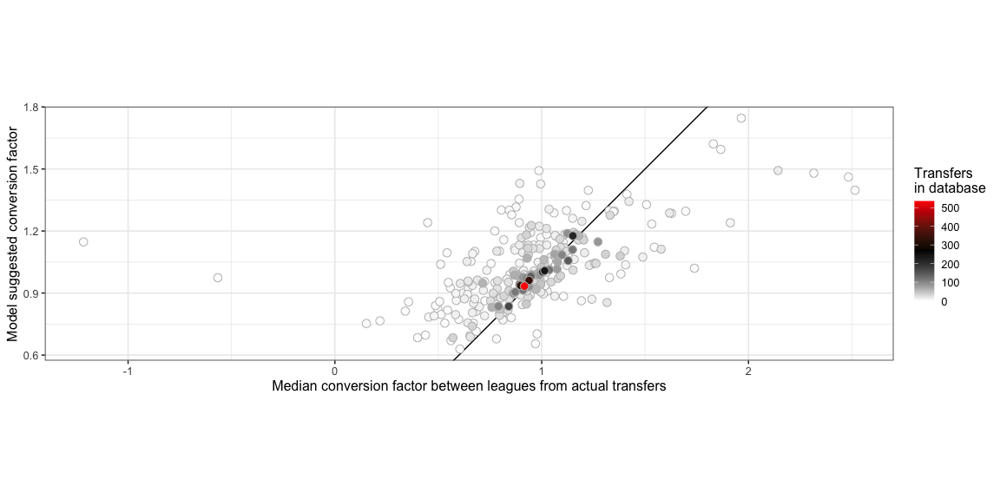
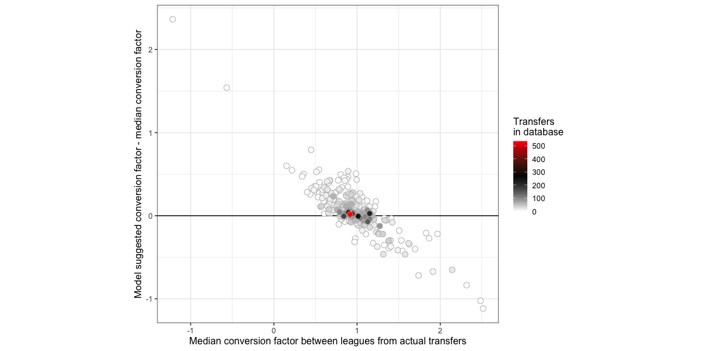
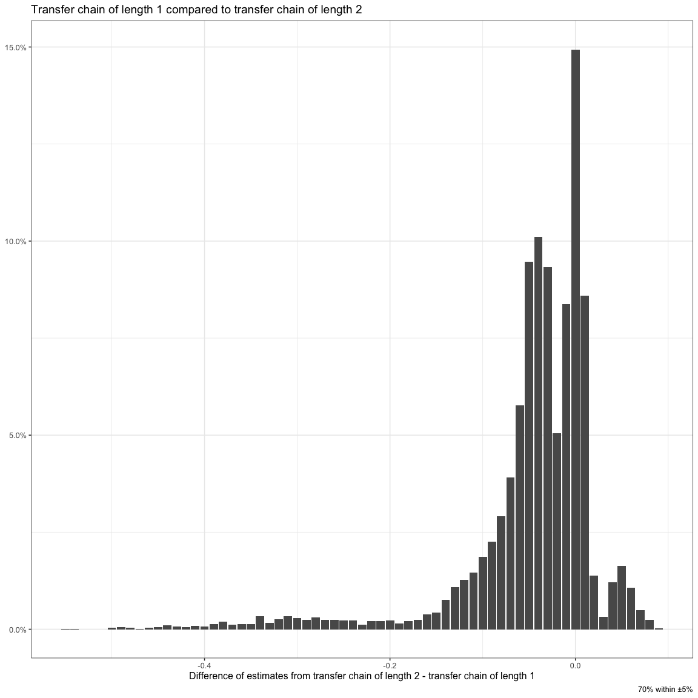
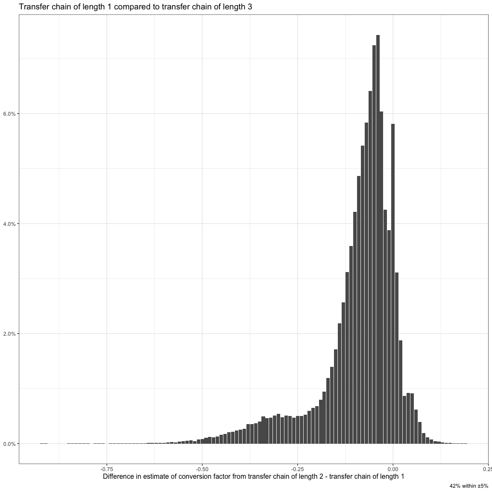

## Motivation

Predicting transfer successes would make me rich.

## Introduction

We’ll try and create a model the predicts the change in a player’s
performance after a transfer based on the previous league and the next
league. In this process, we will get a more general mapping between
pairs of leagues allowing us to extract some more insights.

## Inputs

We use
[VAEP](https://github.com/soccer-analytics-research/fot-valuing-actions),
a way to measure the value of individual actions in football. The link
has more details but in short, it calculates a probability of a team
eventually scoring a goal as a result of a player performing a certain
action.

[canzhiye](https://twitter.com/canzhiye) has fortunately computed this
for all the players playing in a bunch of leagues for the last some
years.
[TonyElHabr](https://tonyelhabr.rbind.io/post/soccer-league-strength/)
recently used it in a model to solve the same problem as me which is
where this discussion started and he was kind enough to help me get
access to the data to try my approach on it too. We have different
models though so you should go and read his post as well.

    if ( T ) {
       library(data.table)
       library(ggplot2)
       library(scales)
       library(CodaBonito)
       library(glmnet)

       knitr::opts_chunk$set(
          echo = F,
          message = F,
          warning = F,
          fig.width = 12,
          fig.height = 6
       )

       theme_set(theme_bw(12))

    }

    ## Loading required package: Matrix

    ## Loaded glmnet 4.1-2

## Model Structure

This model will centre on a player’s VAEP/minute value as a measure
their performance.

Imagine we had just four leagues that we were trying to model. You could
go from each league to any other league and that would look a little
like this -

Each link is a path between two leagues and a player could travel in
either direction on that link. So a player could go from the EPL to La
Liga or from the La Liga to the EPL, and similarly for any other pair of
leagues.

Imagine a player moved from the EPL to the La Liga. This player’s VAEP
per minute in their last season in the EPL was 0.005 when in the EPL and
in their first season in La Liga it was 0.006. This is how this would
look like in this visualisation.

Based on this one observation, we’d say any player going from the EPL to
La Liga can expect their VAEP/minute to go to 0.006/0.005 = 120% of what
it was in the EPL. Let us ascribe a value of 120% to the EPL - La Liga
link. I’m going to call this value the observed VAEP conversion factor.

Let’s do away with links that allow travelling in either direction and
keep only links that let you travel in one direction. This means players
moving from La Liga to the EPL which would need a different link to the
link above. This is what our graph now looks like, with two links
connecting each pair of leagues, one of the links from league a to
league b, and the other from league b to league a. It’s a little painful
to cleanly draw arrows for so many links so going to skip that but
hopefully the description makes it clear.

One of the possibilities to model the La Liga to EPL link is to just
assume that it is the inverse of the EPL to La Liga. In the earlier
example, the EPL to La Liga link was 120% so the La Liga to EPL link
would then become 1/120% = 83.33%. I don’t take this approach and I let
them remain independent of each other to allow for the possibility that
this relationship may not exist between the two links.

Another kind of transfer possible is also to a different team within the
same league. Players could gain or lose on the VAEP / minute metric even
for those transfers so we need our model to worry about that too. We
would need another kind of link for this which starts and ends at the
same league.

Based on actual transfers we can calculate a median observed VAEP
conversion factor the links over which players moved. A couple of things
to note about this:

-   We can also measure how confident we are about the median based on
    the number of transfers over that link - the more the transfers the
    more confident we can be that the median we have calculated is close
    to the actual VAEP conversion factor of the link. For eg. if we
    looked at only Eden Hazard moving from EPL to La Liga we’d think the
    VAEP conversion factor is ( proabably, I’m guessing ) very low from
    the EPL to La Liga, but if we add Cristiano Ronaldo, Modric,
    Coutinho, and all the other players that made a move then we would
    get a better idea of typically what the observed VAEP conversion
    factor is.

-   We need to incorporate time by giving more importance to recent
    transfers and less importance to transfers that happened very long
    ago. Therefore we’d give higher importance to Hazard’s observed VAEP
    conversion factor, lesser to Ronaldo’s, somewhere in between for
    Coutinho, and so on.

It is possible that some of these links have seen very few transfers or
haven’t seen any transfers recently. We may not have a median observed
conversion factor or have one with very low confidence on it. What we
can do is use links between other leagues and these two leagues to try
and adjust the observed median conversion to get some more confidence.
For eg. let us assume we have never seen a transfer between Ligue 1 to
the EPL but we have seen transfers from Ligue 1 to La Liga and La Liga
to EPL then we can combine the knowledge from the links between these
two leagues and La Liga to try and derive or adjust the value for the
Ligue 1 to EPL link.

Let us make the assumption that moving from Ligue 1 to the EPL directly
would result in a very similar conversion factor as moving from Ligue 1
to La Liga to EPL. In other words, we can estimate the conversion factor
of Ligue 1 to EPL as being equal to the conversion factor of Ligue 1 to
La Liga \* conversion factor of La Liga to EPL. We could also include
more roundabout ways of moving from Ligue 1 to EPL, say. Ligue 1 to
Serie A to La Liga to EPL, and adjust our Ligue 1 to EPL link’s
conversion factor further.

This approach is inherently making an assumption. Imagine we have two
Ligue 1 players with a similar VAEP/minute in Ligue 1 who moved to the
EPL later in their careers. Let’s say player 1 played in the La Liga
between their Ligue 1 and EPL stint while player 2 directly moved from
Ligue to the EPL. The calibration process described above kind of
ignores the La Liga stint and suggests both players would have a similar
VAEP/minute as each other in the EPL as well. This assumption is
probably not true but for now we’ll stick with it. More about this
later.

## Model Evaluation

One way to measure the quality of the calibration is to evaluate the
difference in conversion factors on various ways of moving between the
same leagues, which I’ll call transfer chains from here on. For eg. how
different is the value of the Ligue 1 to EPL conversion factor compared
to the Ligue 1 to La Liga conversion factor \* La Liga to EPL conversion
factor. A well calibrated model should have a very low difference
between the two.

Another way to measure the quality of the calibration is to evaluate how
far the calibrated conversion factors are from the observed median
conversion factors. We’d want the two values to be close to each other,
especially for pairs of league where we have seens lots of recent
transfers and are confident about our observed median.

## Model Calibration

The calibration process iteratively makes adjustments to the conversion
factors over links in a manner that the two evaluation criteria improve.
It keeps making adjustments until the value of the objectives don’t
change by much since at that point the adjustments are probably of too
little magnitude to be of consequence.

## Results

I had to exclude China Super League from the list of leagues because it
shows up in fourth position on here behind Serie A and messes a little
with the other leagues as well. I imagine moving to China is very
different from moving to a European or South American club and there
might be other things beyond just the sporting ability playing a part
there.

This is what the model suggests are the conversion factors between pairs
of leagues.

Numbers &gt; 1 indicates moving from the league on the left to the
league on bottom usually see the player increase their VAEP/minute by
that factor. The order of the leagues is based on how many leagues have
a conversion factor of &gt; 1 and is roughly an indication of league
strength although strictly speaking it isn’t that. The order is mostly
sensible with a few debatable ones though like Portugal’s Primeira Liga
being above Germany’s Bundesliga.

It’s interesting that for some of the leagues, a transfer within the
same league typically see a drop in the VAEP/minute metric and the
conversion factor is almost never &gt; 1 across any of the leagues.

If the earlier discussion about having the two links between a pair of
leagues modelled as inverse of each other were true then we’d see
diagonally opposite elements being reciprocals of each other, for eg. a
transfer from Spain La Liga to the Scotland Premiership typically
results in the VAEP/minute becoming 1.77 times or 177% and a transfer in
the other direction see it become 0.55 times which is approximately =
1/1.77 so the inverse relationship holds.

Here is a comparison of every conversion factor with the inverse of it’s
corresponding opposite link -

They lie pretty much along the x = y line indicating that even though we
didn’t force the model to keep the inverse relationship, the calibration
reached a solution which upheld that relationship.

This is how much the model suggested conversion factors differ from the
observed factors.

Pairs of leagues which have seen lots of transfers between them have
very similar values from the model and observation, which is a good
sign. A good side effect of our calibration approach is that the model
has chosen to dampen the cases where it say unusually high or low
conversion factors, which is often between pairs of leagues which have
seen very few transfers and therefore low confidence. I kept the recency
aspect out of this chart just for easier interpretation but we keep
recency also as an input in how we decide confidence in the model.

Let us look at the other criteria of comparing the conversion factor
between two leagues based on the various ways in which players could
move between those two leagues. We will do this by comparing the
conversion factor directly from league a to league b with the combined
conversion factor of all other ways in which a player could move between
league a and league b, eg. league a -&gt; b compared to league a -&gt; c
-&gt; b, league a -&gt; c -&gt; d -&gt; b, etc.

The differences are usually very low which means our model was able to
arrive at a solution where all the links were consistent with each other
and in terms of independence of the transfer chain between two leagues.

## How To Use This

This is a very limited model. It is useful but limited. It is limited
because it models the VAEP conversion factor of players who *have* moved
between leagues which may or may not be a good estimate for a random
player moving between leagues. Players who *have* moved are not a random
sample of players so it is a biased view.

It might also just be useful as a macro model and not useful to predict
the VAEP we can expect from specific transfers. Remember we’re
predicting the median conversion using this model. Here is how the
observed VAEP conversion for each individual transfers compares with the
median suggested by the model.

The general trend is reflected in the model’s values but there are large
deviations. You should expect Depay’s output to fall to 90% of his
current output but you can’t be sure.

I’ve been trying to model this difference too but no success yet. In
good news though I also included inputs in this model to check if our
assumption of a -&gt; b being similar to a -&gt; c -&gt; b was wrong but
there is no indication for that either yet. You win some you lose some.

## Another Simplified Model

An easier model to calibrate would be where each league has a from
conversion factor, for when the player transfers out of the league, and
a to conversion factor, for when the player transfers to the league. The
conversion factor for a transfer between those two leagues is a product
of the two conversion factors.

You can take logs and convert it to a linear equation, log(1/from league
a factor) + log(to league b factor) = log(conversion factor), and then
solve it as a linear regression. We could also try having just one
factor for each league and using it and its inverse as a to and from but
same logic as earlier, this will allow for an independent relationship
between those two so we’ll keep them separate.

An example of the dataset we’ll give to linear regression for our first
example for a transfer between the EPL to the La Liga would look like
this -

<table>
<colgroup>
<col style="width: 9%" />
<col style="width: 12%" />
<col style="width: 12%" />
<col style="width: 12%" />
<col style="width: 7%" />
<col style="width: 10%" />
<col style="width: 10%" />
<col style="width: 10%" />
<col style="width: 18%" />
</colgroup>
<thead>
<tr class="header">
<th style="text-align: right;">from_EPL</th>
<th style="text-align: right;">from_LaLiga</th>
<th style="text-align: right;">from_Ligue1</th>
<th style="text-align: right;">from_SerieA</th>
<th style="text-align: right;">to_EPL</th>
<th style="text-align: right;">to_LaLiga</th>
<th style="text-align: right;">to_Ligue1</th>
<th style="text-align: right;">to_SerieA</th>
<th style="text-align: right;">conversion_factor</th>
</tr>
</thead>
<tbody>
<tr class="odd">
<td style="text-align: right;">-1</td>
<td style="text-align: right;">0</td>
<td style="text-align: right;">0</td>
<td style="text-align: right;">0</td>
<td style="text-align: right;">0</td>
<td style="text-align: right;">1</td>
<td style="text-align: right;">0</td>
<td style="text-align: right;">0</td>
<td style="text-align: right;">1.2</td>
</tr>
</tbody>
</table>

There would again be an extra weight to take into account the recency of
the transfer, where we give more importance to recent tranfers and less
importance to older ones. Each transfer is now fed independently into
this model, as compared to the earlier model where we sent medians, so
we don’t need to explicitly incorporate the count of transfers between
leagues.

One problem that there is though that you can’t take logs of negative
values but we have very very few negative observed conversion factors (
i.e. cases where overall VAEP was negative ) so we’ll just ignore them
for now.

Here are what the results for this simple model look like. They are
quite similar to our earlier model and probably worth it for the ease of
calibrating this.

So now that we have a to factor and a from factor for each league, as
compared to have a separate relationship between each pair of leagues,
we need to look at this matrix a little differently. The values along
the rows are representative of the from factor, and the values along the
columns representative of the from factor. Scotland’s Premiership and
Russia’s Premier League are interesting because its values along its
rows suggest that most players that transfer from that league to other
leagues have a &lt;1 conversion factor but players coming to those
leagues from most other leagues also have a &lt;1 conversion factor.
This means that these leagues are probably tough to play in even if
players are coming from other leagues considered higher quality leagues.

## Adding Other Factors to the Simple Model

Now that we have a simple model which is easy to calibrate, let us see
if we can add more granularity to it. This is again with a view to
bridging the variance of the actual conversion values compared to the
overall prediction between a pair of leagues.

This hasn’t been very successful though so don’t keep your hopes up for
the rest of the article.

Let’s add variables to this dataset which captures the teams which works
the same way as the league variables, a -1 in the from\_team column and
a +1 in the to\_team column and try and regress this. The coefficients
aren’t individually as strong a predictor anymore though because there
are a lot more variables that the model is trying to split the effect on
the output amongst many more input variables.

Here is what the league comparison looks like with this model.

That isn’t very good. Sigh.

I really want this model to work because unlike earlier where we were
trying to predict the median, this uses individual transfers and has
context of the teams so if one team makes many more transfers than
another team in the same league then the first team will have a much
higher influence on the median for the league which will distort the
*typical* expectation from that league. What I’m going to do is add a
small regularisation penalty to avoid coefficients becoming too large
away from 1. Let’s see what this looks like now.

Much better. More believable although quite different from our first result. The difference is not a bad thing though because now we're including team effects whereas earlier we were ignoring it. I'd probably trust this model more than the earlier one. We could probably do some more fine tuning but it is reasonable right now so let us proceed.v

The predictions are still not great though.

Now is a good time for us to drop interpreting these coefficients as an
indicator of league or team strength and go back to seeing them as what
they should be seen as - an indicator of how well players perform after
transfers. In this case, since we have modelled the difference from the
league based predictions, this is really a measure of how well the
players do after transfers after adjusting for the change of league.
Amongst teams that have had at least 5 transfers to and from them, here
is how the coefficients look -

I can think of some interpretations for this plot:

-   teams on the bottom right are likely coached very well since players
    coming to them play much better than their previous teams while
    players players leaving them typically see their output drop after
    adjusting for league change
-   teams on the top left are the opposite - likely coached very poorly
-   teams on the top right are teams that typically get players on their
    way up, they typically see players improve when they come to the
    team and when they leave the team after adjusting for league change
-   teams on the bottom left are teams that typically get players on
    their way down

Some of the names make sense against this description but maybe not all
of them. That said, the model is again not confident about most of the
coefficients and therefore you should expect a large case to case
variance around this prediction, which is what the earlier plot of the
prediction vs. actual conversions for this model was also suggesting.

## Adding Other Factors to the Simple Model - 2

Instead of regularising, I tried another thing where I hold the the
league level coefficients constant from our simplest model and letting
the team level variables account only for the difference between each
individual transfer’s conversion factor and the league pair suggested
conversion factor. This is mixed effects model territory.

The relationship between leagues would remain the same as the simple
model so the coefficients for the teams is our focus here.

Based on the visual, there isn’t a large improvement in the predictions
though. The model’s predictions of the coefficients are also often not
very confident but let us take a look at them anyway.

## Wrapping Up

I also tried adding features related to age, physical attributes,
playing position, matches or time played, and experience from other
leagues to see if they helped narrow the prediction down but no luck.
Going to have to continue at my job for some more time, I guess.

For feedback, suggestions, etc. [find me on Twitter,
thecomeonman](https://www.twitter.com/thecomeonman) or drop me a mail -
mail dot thecomeonman at gmail.
